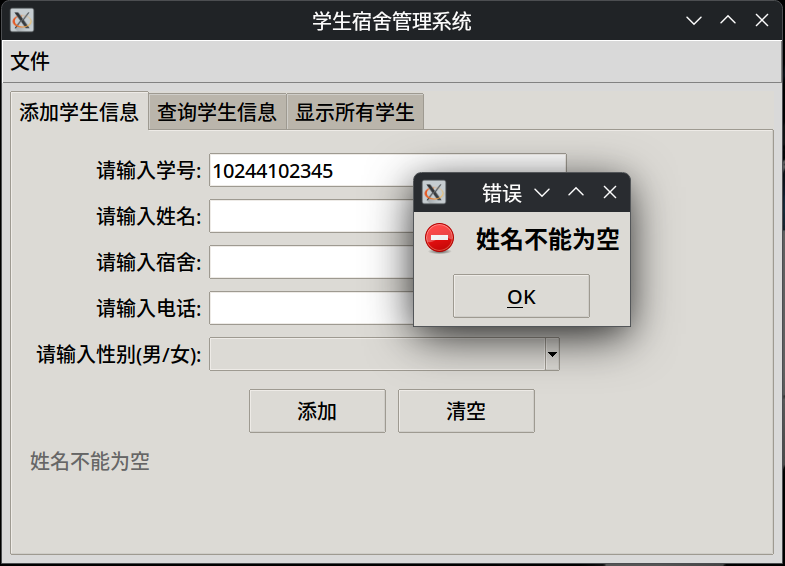
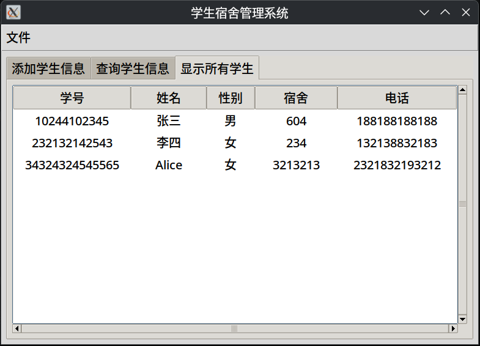

# Lab-01

## files

- `g.py`: GUI 版本的管理系统 (180 loc)
- `t.py`: CLI 版本的管理系统 (50 loc)
- `env.sh`: 运行环境测试，通过则可以正常使用 GUI 版本

## why gui?

- fun && cool
- challenging: 尝试在不完全失去可读性的前提下，用 200 行实现尽可能多的功能

## dep

- `t.py`: 无外部库依赖
- `g.py`: `tk` (python builtin, but may have shared object issues)
  - 环境验证: `chmod +x env.sh && ./env.sh`，如果出现窗口，则正常

## run

假定你使用 Linux:

```
$ chmod +x ./g.py
$ ./g.py
```

CLI 版本同理

## features

- 输入校验:



- 易用界面



- 持久化存储

```json
[
    {
        "学号": "10244102345",
        "姓名": "张三",
        "性别": "男",
        "宿舍": "604",
        "电话": "188188188188"
    },
    {
        "学号": "232132142543",
        "姓名": "李四",
        "性别": "女",
        "宿舍": "234",
        "电话": "132138832183"
    },
    {
        "学号": "34324324545565",
        "姓名": "Alice",
        "性别": "女",
        "宿舍": "3213213",
        "电话": "2321832193212"
    }
]
```

## structure

- 学生信息管理: `StudentManager`: 所有的数据校验和存储都在这里，校验失败抛 ValueError，让上层 UI 决定如何提示
- 界面骨架: `App(tk.Tk)`
  - 用 `TkDefaultFont` 的 `linespace` 算出行高 `rh = linespace + 8`，配置到 `Treeview`，防止行高不足导致文字被截断
- 添加学生: `_tab_add`
  - 成功时主动刷新 "显示所有" 页，能立刻看到新的记录
- 按学号查询: `_tab_query`
  - 目前没有模糊匹配，Levenshtein Distance 实现出来超过了 200 行限制，遂删除
- 显示所有: `_tab_all`
  - `_autosize()` 函数实现了自适应列宽，在极端的输入下也能最大程度保证列宽均匀

# TODO

- 由于还剩 20 行的空间，或许可以做手机号和宿舍的校验
